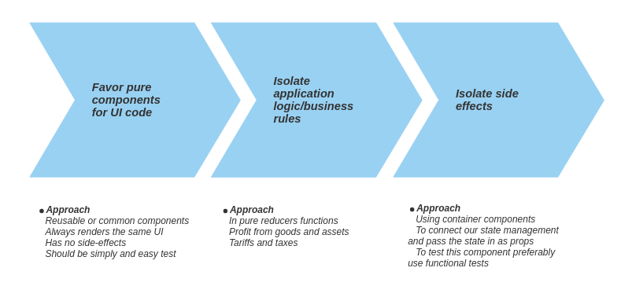

# Training React Hooks

I'll be explaining little by little what I'm encountering either problems, frameworks or perspectives.

## Unit testing React

As any quality development requires unitary tests which I will carry out with the following frameworks that are the most known and therefore I chose them.

[Jest](https://jestjs.io/) is a testing framework with a focus on simplicity.

[Enzyme](https://airbnb.io/enzyme/) is a javascript testing utility for React that makes it easier to test your React Components' output. You can also manipulate, traverse and in some ways simulate runtime given the output.   

Some things to keep in mind according to [Unit Testing React Components](https://medium.com/javascript-scene/unit-testing-react-components-aeda9a44aae2):

* **Favor pure components for UI code:** given same props, always render the same component. If you need state from the app, you can wrap those pure components with a container component which manages state and side-effects.
* **Isolate application logic/business rules** in pure reducer functions.
* **Isolate side effects** using container components.

A pure component is a component which, given the same props, always renders the same UI, and has no side-effects. Some examples [here](https://github.com/zofip/zof-pro-hook/tree/master/src/common). This components should be simple and easy to test.

The react components can be more maintainable and easy to debug **Isolate your state and side-effect management in a container component**,  and then pass the state into a pure component though props.

It's still a good idea to keep our code in three different buckets, and keep these buckets isolated from each other:

* Display/UI Components
* Program logic/business rules
* Side effects \(I/O, network, disk, etc\)

Create new test file for state reducers is recommended to test them individually. Testing the reducer is testing the action creators and selectors, and viceversa. You still achieve the same test and case coverage as you would if you tested them independently. 

The components are only job is to **connect** our state management and pass the state in as props to our unit-tested **pure component**. 

Tests for the container component use functional tests., which run in-browser and simulate user interactions with the actual UI, running end-to-end.

The following graph summarizes how should separate the components of our application so that they are easy test:

\*\*\*\*

